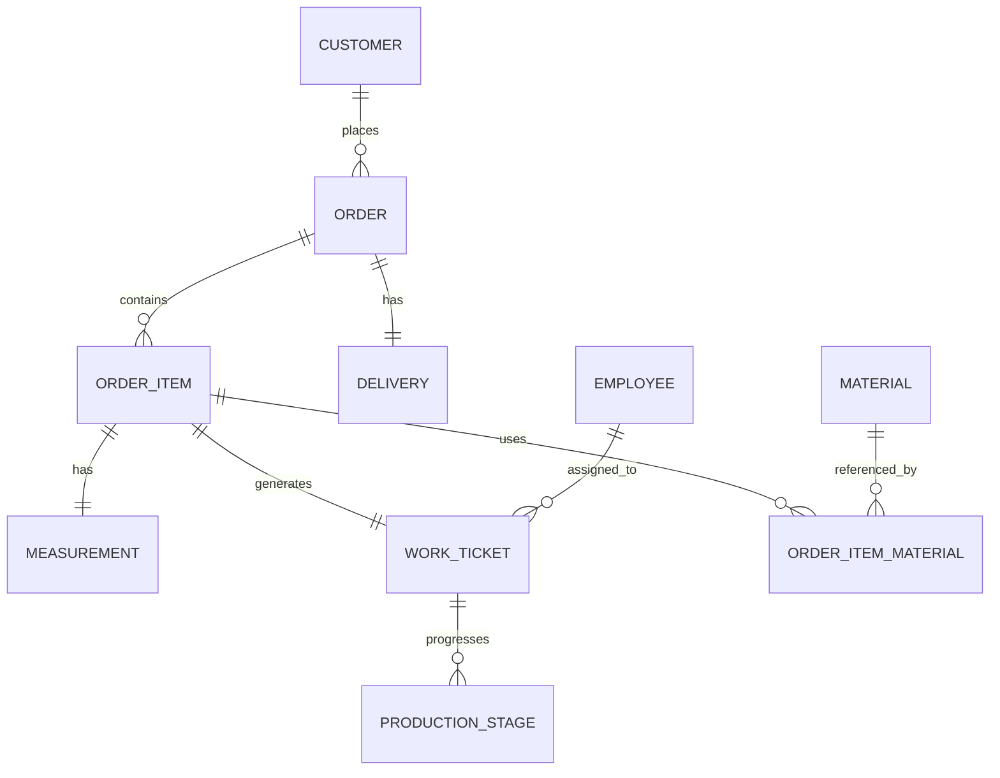

# Sewing Shop Management System

## 1) Problem Description
Sewing shops often track customer requests, measurements, production, and delivery with paper notes or fragmented tools. This causes missed due dates, limited visibility into work progress, and difficult follow-up with customers.

This project provides a Django-based management system that organizes the full lifecycle of a custom garment order: customer registration, order intake, ticket-based production tracking, and final delivery.

### Scope
- Customer registration and history.
- Orders and multiple garments per order.
- Work tickets per garment.
- Multi-stage production tracking.
- Delivery and completion tracking.
- Monitoring dashboard and admin filters.

### Intended Users
- Shop receptionist or front-desk staff.
- Production manager.
- Tailors/workers.
- Owner/administrator.

## 2) Requirements Description

### Main Features
- Customer management (`Customer`).
- Order management (`Order`, `OrderItem`).
- Ticket/work order management (`WorkTicket`).
- Production stage tracking (`ProductionStage`).
- Measurements and materials (`Measurement`, `Material`, `OrderItemMaterial`).
- Delivery management (`Delivery`).
- Monitoring dashboard and admin filtering.

### Business Rules
- Every order belongs to exactly one customer.
- Every order has one or more order items (garments/tasks).
- Each order item can have one work ticket.
- Tickets contain current status and priority.
- Delivered orders must include a delivery date.
- Once delivery is marked complete, order status becomes `Delivered`.
- Overdue follow-up is based on due date and active status.

### Modules
- `shop.models` for relational entities.
- `shop.admin` for Django Unfold admin workflows.
- `shop.views.dashboard` for operational monitoring.

## 3) Normalized Database Design

### Entities and Keys
- `Customer(id PK, full_name, phone, email, address, notes, created_at)`
- `Employee(id PK, full_name, role, phone, active)`
- `Material(id PK, name, type, color, unit, stock_qty)`
- `Order(id PK, customer_id FK, order_date, due_date, status, observations)`
- `OrderItem(id PK, order_id FK, garment_type, color, design_notes, quantity)`
- `Measurement(id PK, order_item_id FK UNIQUE, chest, waist, hips, length, extra_notes)`
- `WorkTicket(id PK, order_item_id FK UNIQUE, assigned_to_id FK, status, priority, deadline, notes)`
- `ProductionStage(id PK, work_ticket_id FK, stage_name, started_at, completed_at, comments)`
- `Delivery(id PK, order_id FK UNIQUE, delivery_date, method, delivered, final_comments)`
- `OrderItemMaterial(id PK, order_item_id FK, material_id FK, quantity_used, notes, UNIQUE(order_item_id, material_id))`

### Relationship Summary
- Customer 1:N Order
- Order 1:N OrderItem
- OrderItem 1:1 Measurement
- OrderItem 1:1 WorkTicket
- WorkTicket 1:N ProductionStage
- Order 1:1 Delivery
- Employee 1:N WorkTicket
- OrderItem M:N Material through OrderItemMaterial

### Normalization Notes
- Design is in 3NF:
  - Repeating groups removed (materials split to through table).
  - Non-key attributes depend on the key of each table.
  - Transitive dependencies avoided by separate entities (customer/order/item/ticket/stage).

## 4) ERD (Text Version)

## 5) Working Application Components
- Django models in `shop/models.py`.
- Django Unfold admin configuration in `shop/admin.py`.
- Dashboard/reporting view in `shop/views.py` and `templates/shop/dashboard.html`.
- URL wiring in `config/urls.py` and `shop/urls.py`.

## 6) Setup Instructions

### Prerequisites
- Python 3.11+ (project currently uses a local `venv` with Python 3.13).
- MySQL or PostgreSQL (this setup is configured for MySQL in `config/settings.py`).

### Install and Run
1. Create and activate virtual environment.
2. Install dependencies:
   - `pip install -r requirements.txt`
3. Configure `.env`:
   - `DB_NAME`, `DB_USER`, `DB_PASSWORD`, `DB_HOST`, `DB_PORT`
4. Run migrations:
   - `python manage.py makemigrations`
   - `python manage.py migrate`
5. Create admin user:
   - `python manage.py createsuperuser`
6. Start server:
   - `python manage.py runserver`
7. Access:
   - Dashboard: `http://127.0.0.1:8000/`
   - Admin: `http://127.0.0.1:8000/admin/`

## 7) Workflow Documentation

### Workflow 1: Customer Order Creation
1. Staff creates a new customer in admin.
2. Staff creates an order for that customer and sets due date.
3. Staff adds one or more order items (garments/tasks).
4. Staff records design notes and quantity.
5. Optional: add measurements and material requirements.

### Workflow 2: Ticket Creation and Production Follow-up
1. Production manager creates a work ticket for each order item.
2. Assign ticket to an employee and set priority/deadline.
3. Add production stages as the garment progresses.
4. Update stage comments, start/completion timestamps, and ticket status.
5. Use admin filters/dashboard to monitor pending and in-progress workload.

### Workflow 3: Order Completion and Delivery
1. After production and quality checks, set order status to `Completed`.
2. Create/update delivery details (method, date, comments).
3. Mark delivery as complete.
4. System enforces delivery date when delivered and updates order to `Delivered`.
5. Historical data remains available under customer and order records.

## 8) Optional Demo Data
- You can add demo data from the admin panel after migrations.
- Recommended minimum seed:
  - 5 customers
  - 10 orders
  - 20 order items
  - 20 tickets and production stages
  - 10 deliveries
